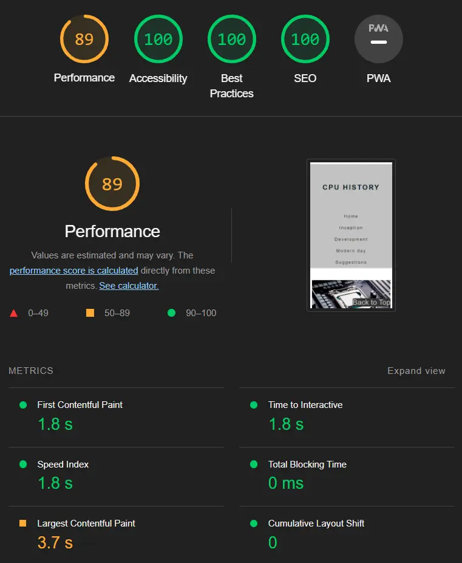

# CPU History Site

This project is for a static website built using HTML and CSS which aims to detail some of the history of the CPU and its development, remaining conscious of accessibility and responsiveness for a variety of devices.
A live version of the site can currently be found [here](https://fwiffoplays.github.io/cpu-history-site/)

## Features

The majority of the content within site is contained within a single scrolling page, including navigation buttons at the top of the page to jump to a specific section and a 'back to top' button which allows the user to easily return to the top in order to navigate somewhere else. The scrolling nature of the main content allows for the user to read through the content without interruption but still allows for easy navigation through the use of the provided navigation buttons.

### Navigation Menu

### Back-to-top button

### 404 Page
A custom 404 page has been implemented on the site so that in the event a user navigates to an invalid page they can easily return to the index.

### Suggestions Form

### Favicons

## Design

A simple design is employed on the site, focusing primarily on a consistent 'metal grey' colour scheme in line with the theme of the CPU and technology, as well as a simple to navigate and understand layout which does not impede the user's reading of the content.

## Technologies

The primary technologies used for this project were:

- HTML
  - HTML is responsible for representing the content within the page
- CSS
  - CSS dictates the styling and formatting of the content which has been placed on the page through HTML
  - Flex-box formatting was used within CSS to align the pages' contents.
- All images displayed on the site were converted to the 'webp' format, offering better image compression and therefore smaller file sizes for faster page load times. This becomes more important as more pictures are added to the site, otherise the user could have to wait several seconds or more for the page's content to be correctly displayed, harming the user experience.

## Testing

Several forms of testing took place throughout the site's development. The most frequent and simple form being a visual check of the change which occured from code changes, done by hosting a web server within the Gitpod environment and navigating quickly throughout the site.

Lighthouse testing was also carried out using the development tools built into Google Chrome. The results for the site were as follows:

## Deployment

The final deployment of the site was completed using Github Pages. This is done by going to the settings of the site's repository, navigating to th 'Pages' section and clicking deploy. After a short time the site is deployed to your github directory. In my case, this would be 
https://fwiffoplays.github.io/cpu-history-site/suggestions.html

## Credits

Hero image from user 'tomeqs' on Shutterstock: https://www.shutterstock.com/g/tomeqs?q=cpu

Intel C4004 image from 'Thomas Nguyen' on Wikipedia: https://en.wikipedia.org/wiki/Intel_4004#/media/File:Intel_C4004.jpg

Intel Pentium P54C die image from 'Pauli Rautakorpi' on Wikipedia: https://en.wikipedia.org/wiki/Pentium_(original)#/media/File:Intel_Pentium_P54C_die.jpg

Apple M1 processor illustration from Henriok on Wikipedia: https://en.wikipedia.org/wiki/Apple_M1#/media/File:Apple_M1.jpg

Burning CPU image from StockFreeImages: https://www.stockfreeimages.com/8976244/Burning-processor.html

Happy CPU image from Heriyusuf on Vecteezy.com: https://www.vecteezy.com/vector-art/3439377-happy-processor-cartoon-playing-soap-bubble